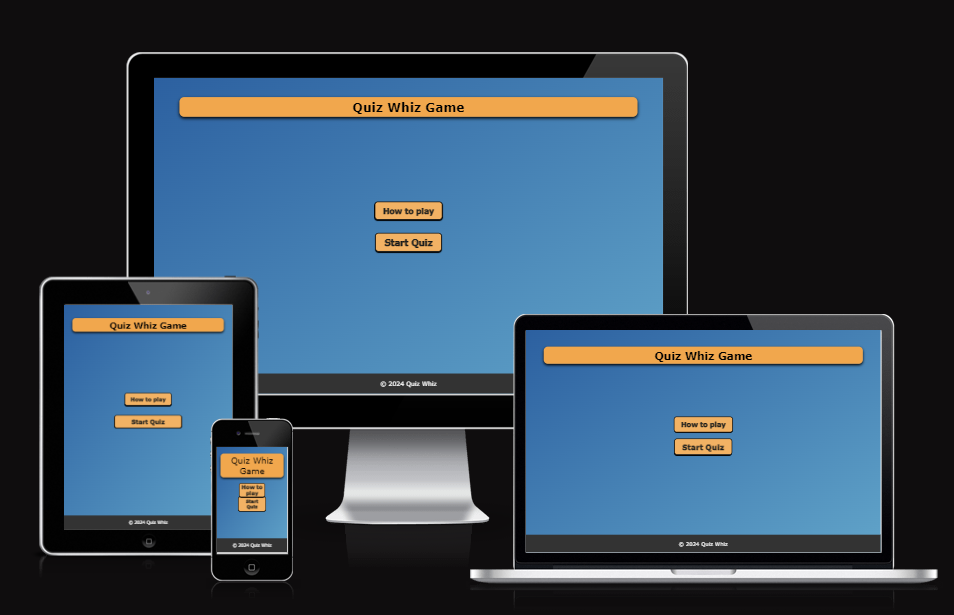

# QUIZ WHIZ!!

## PROJECT OVERVIEW

-The aim of this site is to test the user's knowledge on general facts from around the globe.
-This site can be great value to students or anyone who want to check their general knowledge.
-Quiz Whiz is an exciting and fun quiz game that challenges its users on their general knowledge.
-This Quiz site is for people who are interested in testing themselves on the general topics of the world.
-This website is to be passed as my second project portfolio for code Institutes Fullstack development course

## Core Purposes of the website
This website is made for people who want to challenge on the general topics of the world.The websites aim is to provide a somewhat challenging quiz to entertain online users. The questions are from a variety of categories and aren't specifically aimed at any subject in particular.

# UX Design

## User Stories

### As a first time user

-I want a responsive site that will accomodate all screen sizes.
-I want to be able to play a fun, interactive game that will entertain me.
-I would like to trial my general knowledge to see how much I know.
-I want buttons that work as they are supposed to be.
-I want a how to play button that gives instructions on how to play game.
-I want an alert section which shows whether the option i clicked is correct or incorrect
-I want to see an indication on whether i got a correct or wrong answer.
-I want to see my score at the end of the game.
-I want to see after the game to play again or try again button.

### As a returning user

-I want the site to be compatible to different devices in times i want to play.
-I want to experience a refreshed and randomized order of questions in each game to prevent memorising and manitain the element of surprise.
-I would like to have the option of choosing a variety of quizzes in different subject areas.

### This Website will be accessible to all devices and screens

# Structure

## Landing Page

-Uses the visually appealing color combination Linear Gradient color background to provide a sense of warm welcoming.
-Provides a minimalist design that features just 2 buttons,eliminating unneccessary complexity and straight forward experience.
-conatains a model features that pops up,containing a set of instructions when the "How to play " button is clicked.

### User Goal

  > - Appreciate the unique design of the site.
  > - Seamless and straightforward user experience.
  > - Easy access to the start game and instructions menu.
  > - Short and concise set of instructions.
        
### Website Goal  
  > - Provided with simple colors for good feel and look.
  > - Provided a pop up feature that users can click to read the instructions on how to play the game.
  > - A responsive design that accomodates different screen sizes.

### Title Section

- The title section is strategically placed centered and at the top of the page.
- A mode feature is added in the how to play button.
- The start button & how to play button takes you to start quiz & how to play instructions.
- The modal contains a set of text that instructs the users how the quiz is played. 
- A close button is located at the buttom of the model for easy access in closing button.
- A border and border-radius around the mode makes it consistent with the design of the website.
- The timer is set to 30 seconds,if the user does not answer in 30 second it takes him try again page with a message stating "you ran out of time"

## Game Page

### User Goals
> - Alert button when getting correct and incorrect anwers.
> - Count down time when quiz is started.
> - Have a score tracker to monitor how well I am doing with the quiz.

### Website Goals
  
  > - Provide a randomized set of questions everytime to maintain the element of surprise.
  > - Provide a simple design that helps to keep user understand easily.

### Game Section
- The game is set to reveal upon clicking the Start button.
- Below the "QuizWhiz Game" there is the question with four options.
- Each option in the option section is placed in rectangle box.
- A hover animation is added to the options.
- The questions were coded to give a random sequence of question every time, this is done to help maintain an element of surprise.
- The Alert showes when the user clicks on option button to show whether the question answered is correct or incorrect.

## Results Section

### User Goals
  
  > - A result page that shows final score.
  > - A button that allows me to play again or Try again.
  > - If time is up the result page should take me to "Ran out of time" and play again or try again.

### Website Goals
  
  > - A clickable button allowing the player to play a new game.

### Results Section

- The results section follows the design of the landing page, with a heading section containing the name of the website.
- Scoreboared button to show user score.
- A button that will take me back to the start of the page.

### Website Goals

> - Provided a consistent color palette and design throughout,
> - A button that links the user back to the start of the game, and be able to start a fresh game.

## Color Scheme
A warm and welcoing color that helps user visual interest.

